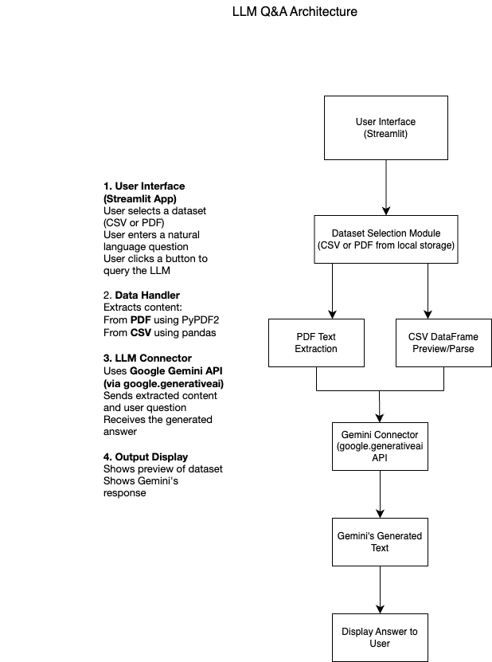

**Clarinda Ewurama Awotwi** 
**10211100239** 
**Computer Science**
**Level 400**

# AI Model Playground

This is an interactive Streamlit application for investigating Machine Learning and AI with real datasets. 

# Features

- **Regression**: Using linear regression, the provided data is analyzed and prediction is made.
- **Clustering**: Grouping data in clusters and visualising them using 2D/3D plots, using unsupervused learning.(K-Means)
- **Neural Network**: Build and train deep learning with a feedforward neural network for classification.
- **LLM Q&A**: Generate content and insights using LLMs.

# Directory Structure

ML_AI_Explorer/
├── app.py
├── .env
├── README.md
├── requirements.txt
├── LLM Architecture.draw.io.png
├── datasets/
│   ├── Ghana_Election_Result.csv
│   ├── 2025-Budget-Statement-and-Economic-Policy_v4.pdf
│   └── ACity_handbook.pdf
├── sections/
│   ├── __init__.py
│   ├── home.py
│   ├── regression.py
│   ├── clustering.py
│   ├── neural_network.py
│   └── llm_multimodal.py

# App Structure

Every section can be chosen from the sidebar. The LLM section generates answers from structured or unstructured data using Google Gemini and preloaded datasets.

# LLM Architecture Diagram

# Datasets Used for LLM Q&A

- Ghana Election Results (CSV) [GitHub]
(https://github.com/GodwinDansoAcity/acitydataset/blob/main/Ghana_Election_Result.csv)
- 2025 Budget Statement (PDF) [MoFEP]
(https://mofep.gov.gh/sites/default/files/budget-statements2025-Budget-Statement-and-Economic-Policy_v4.pdf)
- Academic City Handbook (PDF) [Academic City]
(https://acity.edu.gh/downloads/handbook.pdf) 

# Installation

In terminal:
git clone https://github.com/ClarindaAwotwi/AI_Model.git
cd ai_10211100239
python -m venv venv
pip install -r requirements.txt

# .env Configuration

Create a `.env` file in the root:

GEMINI_API_KEY

# Usage

In terminal, type in:
streamlit run app.py

# LLM Methodology

1. The user chooses from three pre-loaded datasets.
2. Content is taken out of the PDF or CSV file.
3. The user's question is added to the context.
4. A request is sent to the Gemini API, and a response is obtained.
5. The app shows the answer in real time.

# Gemini vs ChatGPT

- The application makes use of Gemini AI, which allows for multimodal input of text, photos, and PDFs. On the other hand, unless certain tools are enabled, ChatGPT does not allow PDFs or photos natively.

- Gemini AI and ChatGPT are both compatible with API integration and can be used into programs such as Streamlit.

- Both of these enable dynamic user interaction with the models by offering real-time output within Streamlit.

- Lastly, both models provide a wide token context window, which enables them to effectively process and reason about massive inputs.

# License

MIT License

